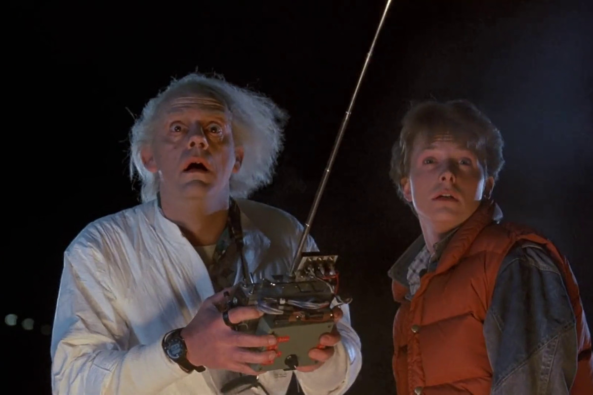

```{r setup, include=FALSE}

knitr::opts_chunk$set(echo = TRUE)
library(tidyverse)
library(spotifyr)
library(compmus)
library(plotly)
library(ggdendro)
library(heatmaply)
library(tidymodels)


```

```{r, include=FALSE}
get_conf_mat <- function(fit) {
  outcome <- .get_tune_outcome_names(fit)
  fit |> 
    collect_predictions() |> 
    conf_mat(truth = outcome, estimate = .pred_class)
}  

get_pr <- function(fit) {
  fit |> 
    conf_mat_resampled() |> 
    group_by(Prediction) |> mutate(precision = Freq / sum(Freq)) |> 
    group_by(Truth) |> mutate(recall = Freq / sum(Freq)) |> 
    ungroup() |> filter(Prediction == Truth) |> 
    select(class = Prediction, precision, recall)
}  

```

```{r, include = FALSE}
circshift <- function(v, n) {
  if (n == 0) v else c(tail(v, n), head(v, -n))
}

#      C     C#    D     Eb    E     F     F#    G     Ab    A     Bb    B
major_chord <-
  c(   1,    0,    0,    0,    1,    0,    0,    1,    0,    0,    0,    0)
minor_chord <-
  c(   1,    0,    0,    1,    0,    0,    0,    1,    0,    0,    0,    0)
seventh_chord <-
  c(   1,    0,    0,    0,    1,    0,    0,    1,    0,    0,    1,    0)

major_key <-
  c(6.35, 2.23, 3.48, 2.33, 4.38, 4.09, 2.52, 5.19, 2.39, 3.66, 2.29, 2.88)
minor_key <-
  c(6.33, 2.68, 3.52, 5.38, 2.60, 3.53, 2.54, 4.75, 3.98, 2.69, 3.34, 3.17)

chord_templates <-
  tribble(
    ~name, ~template,
    "Gb:7", circshift(seventh_chord, 6),
    "Gb:maj", circshift(major_chord, 6),
    "Bb:min", circshift(minor_chord, 10),
    "Db:maj", circshift(major_chord, 1),
    "F:min", circshift(minor_chord, 5),
    "Ab:7", circshift(seventh_chord, 8),
    "Ab:maj", circshift(major_chord, 8),
    "C:min", circshift(minor_chord, 0),
    "Eb:7", circshift(seventh_chord, 3),
    "Eb:maj", circshift(major_chord, 3),
    "G:min", circshift(minor_chord, 7),
    "Bb:7", circshift(seventh_chord, 10),
    "Bb:maj", circshift(major_chord, 10),
    "D:min", circshift(minor_chord, 2),
    "F:7", circshift(seventh_chord, 5),
    "F:maj", circshift(major_chord, 5),
    "A:min", circshift(minor_chord, 9),
    "C:7", circshift(seventh_chord, 0),
    "C:maj", circshift(major_chord, 0),
    "E:min", circshift(minor_chord, 4),
    "G:7", circshift(seventh_chord, 7),
    "G:maj", circshift(major_chord, 7),
    "B:min", circshift(minor_chord, 11),
    "D:7", circshift(seventh_chord, 2),
    "D:maj", circshift(major_chord, 2),
    "F#:min", circshift(minor_chord, 6),
    "A:7", circshift(seventh_chord, 9),
    "A:maj", circshift(major_chord, 9),
    "C#:min", circshift(minor_chord, 1),
    "E:7", circshift(seventh_chord, 4),
    "E:maj", circshift(major_chord, 4),
    "G#:min", circshift(minor_chord, 8),
    "B:7", circshift(seventh_chord, 11),
    "B:maj", circshift(major_chord, 11),
    "D#:min", circshift(minor_chord, 3)
  )

key_templates <-
  tribble(
    ~name, ~template,
    "Gb:maj", circshift(major_key, 6),
    "Bb:min", circshift(minor_key, 10),
    "Db:maj", circshift(major_key, 1),
    "F:min", circshift(minor_key, 5),
    "Ab:maj", circshift(major_key, 8),
    "C:min", circshift(minor_key, 0),
    "Eb:maj", circshift(major_key, 3),
    "G:min", circshift(minor_key, 7),
    "Bb:maj", circshift(major_key, 10),
    "D:min", circshift(minor_key, 2),
    "F:maj", circshift(major_key, 5),
    "A:min", circshift(minor_key, 9),
    "C:maj", circshift(major_key, 0),
    "E:min", circshift(minor_key, 4),
    "G:maj", circshift(major_key, 7),
    "B:min", circshift(minor_key, 11),
    "D:maj", circshift(major_key, 2),
    "F#:min", circshift(minor_key, 6),
    "A:maj", circshift(major_key, 9),
    "C#:min", circshift(minor_key, 1),
    "E:maj", circshift(major_key, 4),
    "G#:min", circshift(minor_key, 8),
    "B:maj", circshift(major_key, 11),
    "D#:min", circshift(minor_key, 3)
  )
```

# Introduction

## Column

**What makes a song "Main Character Energy"?**

My corpus for Computational Musicology will dive into what makes a song feel like someone is the "main character". Beginning in the summer of 2020, peak of Covid, social media and Gen Z became obsessed with the feeling of making their life resemble a movie. We made highlight reels, posted "low-key" and aesthetic photo dumps, and began romanticizing even our daily coffee runs. I have grown up in awe of movies like "Perks of Being a Wallflower", "LadyBird", "Breakfast Club", and "Sixteen Candles". My parents drilled these movies into my head and deemed them "iconic". It's only right for our generation to want to become one of these characters ourselves. Songs like "Don't You (Forget About Me)" by Simple Minds, "Heros" by David Bowie, and even more recent songs like "Ribs" by Lorde have been universally recognized as songs that make you feel like you're in a movie. But what about these songs has this unique effect on people? Yes, some are actually a part of a movie's soundtrack, but others seem to create a movie all on their own. To build my dataset, I will grab [soundtracks from iconic coming of age and indie movies](https://open.spotify.com/playlist/37i9dQZF1DXb69UWhjrXsW) along with playlists that describe themselves as ["main character" or "in a coming of age movie"](https://open.spotify.com/playlist/37i9dQZF1DX4OzrY981I1W) or other titles with the same concepts. I hope to investigate the composition of these songs, lyrics, and types of instruments used to get to the bottom of what makes a song "main character energy". I would like to compare real movie soundtracks to songs that have been titled "to make you feel like you're in a movie" by social media or playlist creators. I hypothesize that the later group will show a stronger emphasis on unique and artistic lyrics, while the former will have a more complex musical score to propel the story along. I would also like to compare the playlist songs (not in a movie) to the top hits of today to find how the songs in the playlists have a different feeling than any of the other "favorite songs" of listeners. With the rise of this very specific genre, I think that Spotify will have a large majority of the songs needed for this corpus. I will use other people's playlists as well as one of my own where I can include all of my favorite songs that give me the "main-character" feeling. Songs that I look forward to analyzing, aside from the ones listed above, are "Wait Just A Little While" by the 502s, "Silver Lining" by Mt. Joy, "Tongue Tied" by Grouplove, and "Electric Love" by BORNS.

## Column

```{r,echo=FALSE, out.width = '90%'}

knitr::include_graphics("DYFAM.png")
knitr::include_graphics("POBAWF.png")
knitr::include_graphics("FBDO.png")

```

## Column

<iframe src="https://open.spotify.com/embed/playlist/37i9dQZF1DXb69UWhjrXsW?utm_source=generator" height="100%" width="100%" style="border: none" allowfullscreen allow="autoplay" data-external="1">

</iframe>

<iframe src="https://open.spotify.com/embed/playlist/37i9dQZF1DX4OzrY981I1W?utm_source=generator" height="100%" width="100%" style="border: none" allowfullscreen allow="autoplay" data-external="1">

</iframe>

# Visualizations {.storyboard}

### Playlist Songs vs Soundtrack Songs

```{r, echo=FALSE}

movieHits <- get_playlist_audio_features("", "37i9dQZF1DXb69UWhjrXsW?si=abdd084bcd204c7a&nd=1")
mainCharacter <- get_playlist_audio_features("", "37i9dQZF1DX4OzrY981I1W")

movieVibes <-
  bind_rows(
    movieHits |> mutate(category = "Songs from a Soundtrack"),
    mainCharacter |> mutate(category = "Songs from 'Main Character' Playlist")
  )
options(repr.plot.width =9, repr.plot.height =9)


table <- movieVibes |>                    # Start with awards.
  ggplot(                     # Set up the plot.
    aes(
      x = valence,
      y = track.popularity,
      size = instrumentalness,
      colour = speechiness
    )
  ) +
  geom_point() + 
  facet_wrap(~ category) +
  theme_light() +             # Use a simpler theme.
  labs(                       # Make the titles nice.
    x = "Valence",
    y = "Popularity",
    colour = "Speechiness",
    size = "Instrumentalness"
  )+ 
  scale_colour_gradientn(colours=rainbow(4)) +
  geom_jitter(position = position_jitter(width = 0.3))
  
ggplotly(table)
```

------------------------------------------------------------------------

I first wanted to look at the major differences between songs that people think are like a movie and songs that actually are in a movie. The most imediate thing I noticed when looking at the two scatterplots side-by-side was the differences in instrumentalness. I assumed that the soundtrack songs would show more instrumentalness and would focus on the timbre of the instruments to move the plot along. However, it was the opposite. The songs that playlist developers put into their "Main character energy" playlist had much higher levels of instrumentalness and a lower level of speechiness. A possible reason for this is that the lack of lyrics allows the lostener to fill in their own storyline or internal thoughts. The kind of instrumentalness serves as a backdrop to their own internal monologue. A movie does not need this and can have higher levels of speechiness during montages to fill in the silence. It can also be seen that the songs in the playlist are overall more popular than the soundtrack songs. This was expected, since there is a higher criteria from prefessionals in order to be a part of a soundtrack and many songs are made for a specific movie rather than for sheer artistic expression. Both groupings had similar valence and I intend on looking at the comparisons and differences between the two sounds (instruments used, timing, etc.) to get to the bottom of what makes these songs so perfect for a coming-of-age/indie/main character feeling.

### Chromagram of "Heros" vs Chromagram of "Green Light"

```{r, echo=FALSE}

#Chromagram of "Heros" by David Bowie
wood <-
  get_tidy_audio_analysis("7Jh1bpe76CNTCgdgAdBw4Z?si=9562548f63ae43a9&nd=1") |>
  select(segments) |>
  unnest(segments) |>
  select(start, duration, pitches)

wood |>
  mutate(pitches = map(pitches, compmus_normalise, "euclidean")) |>
  compmus_gather_chroma() |> 
  ggplot(
    aes(
      x = start + duration / 2,
      width = duration,
      y = pitch_class,
      fill = value
    )
  ) +
  geom_tile() +
  labs(x = "Time (s)", y = NULL, fill = "Magnitude") +
  theme_minimal() +
  scale_fill_viridis_c()


#Chromagram of "Green Light" by Lorde
wood1 <-
  get_tidy_audio_analysis("6ie2Bw3xLj2JcGowOlcMhb") |>
  select(segments) |>
  unnest(segments) |>
  select(start, duration, pitches)

wood1 |>
  mutate(pitches = map(pitches, compmus_normalise, "euclidean")) |>
  compmus_gather_chroma() |> 
  ggplot(
    aes(
      x = start + duration / 2,
      width = duration,
      y = pitch_class,
      fill = value
    )
  ) +
  geom_tile() +
  labs(x = "Time (s)", y = NULL, fill = "Magnitude") +
  theme_minimal() +
  scale_fill_viridis_c()


#Cross Chromagram Analysis of "Heros" and Green Light"
compmus_long_distance(
  wood |> mutate(pitches = map(pitches, compmus_normalise, "chebyshev")),
  wood1 |> mutate(pitches = map(pitches, compmus_normalise, "chebyshev")),
  feature = pitches,
  method = "euclidean"
) |>
  ggplot(
    aes(
      x = xstart + xduration / 2,
      width = xduration,
      y = ystart + yduration / 2,
      height = yduration,
      fill = d
    )
  ) +
  geom_tile() +
  coord_equal() +
  labs(x = "Heros", y = "Green Light") +
  theme_minimal() +
  scale_fill_viridis_c(guide = NULL)
```

------------------------------------------------------------------------

I wanted to focus my chromograms on two songs that I believe create the largest sense of "Main Character Energy" for me, but for two very different reasons. I chose "Heros" by David Bowie because of its appearance in the coming of age movie, *Perks of Being a Wallflower*. The scene where the main character, Charlie, lets go and screams out the sunroof while his new friends are driving through a tunnel is a scene that has stuck with me throughout years. The feeling of freedom and opportunity seemed to swell in that moment and the music wasn't just an addition to the scene, it seemed to be the leader of the scene. I got that same feeling when listening to "Green Light" by Lorde. The yells in the background are quite literally urging you to "go for it". For me, it feels like you are running towards something that you have been waiting for. Its opportunistic. I wanted to see how these two songs correlate on a chromographic level. In many ways, I see similar patterns between the two chromograms. Both start with strong energy from D (of which "Heros" continues with throughout the entire song). Both songs have very strong choruses that are shown with bursts of energy. Later in my corpus, I would like to look more into why the D chord may be so prominent in both of these songs and if that pattern is continued into other songs that give off the same "Main Character" vibe.

### Chordogram of "Electric Love" by BORNS

Electric Love

```{r, echo = FALSE}
electric_love <-
  get_tidy_audio_analysis("2GiJYvgVaD2HtM8GqD9EgQ?si=1f63eb60b2cb4424") |>
  compmus_align(sections, segments) |>
  select(sections) |>
  unnest(sections) |>
  mutate(
    pitches =
      map(segments,
        compmus_summarise, pitches,
        method = "mean", norm = "manhattan"
      )
  )

electric_love |> 
  compmus_match_pitch_template(
    key_templates,         # Change to chord_templates if descired
    method = "manhattan",  # Try different distance metrics
    norm = "manhattan"     # Try different norms
  ) |>
  ggplot(
    aes(x = start + duration / 2, width = duration, y = name, fill = d)
  ) +
  geom_tile() +
  scale_fill_viridis_c(guide = "none") +
  theme_minimal() +
  labs(x = "Time (s)", y = "")
```

------------------------------------------------------------------------

I wanted to move on and look at other songs that give a similar "freedom" vibe as "Heros" and "Green Light" and see if there are any similarities between the chords used in these songs. In the Chromogram, we were able to see alot of D presence in both "Heros" and "Green Light", however I did not determine if that was the base of the chords or just a dominant one in a different chord progression. Listening to "Electric Love" there was a very apparent chord progression of A for 7 beats (as the tonic chord), to B minor for one beat (as the sub-dominant chord), and then to F# minor for 8 beats (as the dominant chord). Looking at the Chordogram of this song, the two lines around 50 seconds and 105 seconds were obviously the moments that stood out to me. In these moments, we are in the bridge of the song. This is the moment where the drums cut out and there is a sense of "calm before the storm", as we are waiting for the big burst of energy from the chorus. This is when the D chord is added into the mix very briefly. Its interesting that the three songs all have a "lead in" of sorts that are based around this D chord.

### Chroma-Based and Timbre Self-Similarity Matrix of "Dont You (Forget About Me)"

Chroma-Based (Left) and Timbre (Right) Self-Similarity Matrix of "Don't You (Forget About Me)" by Simple Minds

```{r, echo = FALSE}
bzt <-
  get_tidy_audio_analysis("6yEAAIEHu4GcUFptg5W9kI") |> 
  compmus_align(bars, segments) |>                     
  select(bars) |>                                     
  unnest(bars) |>                                     
  mutate(
    pitches =
      map(segments,
        compmus_summarise, pitches,
        method = "rms", norm = "manhattan"              
      )
  ) |>
  mutate(
    timbre =
      map(segments,
        compmus_summarise, timbre,
        method = "rms", norm = "manhattan"              
      )
  )

bzt |>
  compmus_self_similarity(pitches, "cosine") |> 
  ggplot(
    aes(
      x = xstart + xduration / 2,
      width = xduration,
      y = ystart + yduration / 2,
      height = yduration,
      fill = d
    )
  ) +
  geom_tile() +
  coord_fixed() +
  scale_fill_viridis_c(guide = "none") +
  theme_classic() +
  labs(x = "", y = "")

bzt |>
  compmus_self_similarity(timbre, "cosine") |> 
  ggplot(
    aes(
      x = xstart + xduration / 2,
      width = xduration,
      y = ystart + yduration / 2,
      height = yduration,
      fill = d
    )
  ) +
  geom_tile() +
  coord_fixed() +
  scale_fill_viridis_c(guide = "none") +
  theme_classic() +
  labs(x = "", y = "")
```

------------------------------------------------------------------------

The first area of the self-similarity matrix of this song that I want to focus on is from about 50 seconds to 110 seconds. When listening to the song and following along with the chroma-based self-similarity matrix, this section of time lines up to when "don't you forget about me" is sung multiple times. This explains the parallel dark blue lines that are shown in that "checker" box. After 100 seconds, however, we lose our anticipated "checkerboard pattern". There does not seem to be many sections within the song that repeat. This song does not follow the basic pop format of verse, chorus, verse, chorus, bridge, chorus. Rather, this song seems to have a beginning "intro" section and then its main section following (100 seconds and onward)

The second area I want to point out is the brightest area within the timbre matrix (190 sec - 230 sec). Because it is the brightest part of the matrix, it is the "most different" from the rest of the song. I originally expected this section of the song to be the loudest when Jim Kerr goes into his "La - la la la la". This is also the point in "The Breakfast Club that John Bender (the"rebellious delinquent" of the movie) punches his fist in the air. However, the bright part was actually signaling the moment right *before* the burst of energy. This part is the quiet lead-in that builds anticipation to the big burst of music. I think this part showed to be the most different on the timbre matrix because much of the background music is cut off and you are left with long, drawn out chords.


### Spotify Timbre Coefficients between Playlist Songs and Soundtrack Songs


```{r, echo = FALSE}
soundtrack <-
  get_playlist_audio_features(
    "thesoundsofspotify",
    "37i9dQZF1DXb69UWhjrXsW?si=abdd084bcd204c7a&nd=1"
  ) |>
  slice(1:30) |>
  add_audio_analysis()
playlist <-
  get_playlist_audio_features(
    "thesoundsofspotify",
    "37i9dQZF1DX4OzrY981I1W"
  ) |>
  slice(1:30) |>
  add_audio_analysis()
compare <-
  soundtrack |>
  mutate(genre = "Playlist with Songs from a Soundtrack") |>
  bind_rows(playlist |> mutate(genre = "Playlist with Songs that have 'Main Character Energy'"))
```

```{r, echo = FALSE}
compare |>
  mutate(
    timbre =
      map(
        segments,
        compmus_summarise,
        timbre,
        method = "mean"
      )
  ) |>
  select(genre, timbre) |>
  compmus_gather_timbre() |>
  ggplot(aes(x = basis, y = value, fill = genre)) +
  geom_violin() +
  scale_fill_viridis_d() +
  labs(x = "Spotify Timbre Coefficients", y = "", fill = "Genre")
```

------------------------------------------------------------------------

To get a better idea of how I can compare the original two playlists in a more descriptive way other than numerically measured components, I looked to the Spotify Timbre Coefficients. One part I would like to point out about this violin graph is the stark similarity between the two playlists in coefficients 1, 6, and 8. In almost every coefficient, there was a general trend in the same direction between the two groupings, but these three coefficients seem to almost mirror each other. The other aspect that is of note is the higher variance of coefficient 2 in the playlist with songs that are meant to make you *feel* like your in a movie. The playlist with soundtrack songs seemed to be much less spread out. The second coefficient is focused on loudness. Does this wide variety of volume in the "Main Character" playlist correlate to the higher level of instrumentalness we saw in the side-by-side scatterplots?

### Histogram of Tempi from Playlist Songs and Soundtrack Songs

Histogram

```{r, echo= FALSE}
soundtrack_tempi <-
  get_playlist_audio_features(
    "spotify",
    "37i9dQZF1DXb69UWhjrXsW?si=abdd084bcd204c7a&nd=1"
  ) |>
  slice(1:30) |>
  add_audio_analysis()
playlist_tempi <-
  get_playlist_audio_features(
    "spotify",
    "37i9dQZF1DX4OzrY981I1W"
  ) |>
  slice(1:30) |>
  add_audio_analysis()

moovie <-
  bind_rows(
    soundtrack_tempi |> mutate(playlist1 = "Playlist with songs from a Soundtrack"),
    playlist_tempi |> mutate(playlist1 = "Playlist with Songs that have 'Main Character Energy'"),
  ) |>
  mutate(playlist1 = factor(playlist1)) |>
  mutate(
    segments =
      map2(segments, key, compmus_c_transpose)
  ) |>
  mutate(
    segments =
      map(
        segments,
        mutate,
        pitches = map(pitches, compmus_normalise, "manhattan")
      )
  ) |>
  mutate(
    segments =
      map(
        segments,
        mutate,
        pitches = map2(pitches, lag(pitches), `-`)
      )
  ) |>
  mutate(
    segments =
      map(
        segments,
        mutate,
        timbre = map2(timbre, lag(timbre), `-`)
      )
  ) |>
  mutate(
    segments =
      map(
        segments,
        slice,
        -1
      )
  ) |>
  mutate(
    pitches =
      map(segments,
        compmus_summarise, pitches,
        method = "mean", na.rm = TRUE
      ),
    timbre =
      map(
        segments,
        compmus_summarise, timbre,
        method = "mean", na.rm = TRUE
      )
  ) |>
  mutate_at(vars(pitches, timbre), map, bind_rows) |>
  unnest(cols = c(pitches, timbre))


```

```{r, echo=FALSE}
table1 <- moovie |>                    # Start with awards.
  ggplot(                     # Set up the plot.
    aes(
      x = tempo)
  ) +
  geom_histogram(binwidth = 20) + 
  facet_wrap(~ playlist1) +
  theme_light()          # Use a simpler theme.
  
table1
```

------------------------------------------------------------------------

I wanted to look at the difference in tempos between the two playlists in my corpus to find out if there is any correlation between tempo and what deems a song good for a soundtrack or "main character" song. Both histograms seemed to be skewed right with a majority of their songs on one side and then more spread out as the tempo increases. I did notice that the songs that are a part of a soundtrack had a lower peak tempo count (centered about 100 bpm) whereas the playlist songs were generally a bit faster (centered about 120 bpm). What I really want to look at for tempo is if there is a change between the variance of tempo for each song within the two groups (somehow find the variance for each song and then make a histogram looking at that measurement rather than the spread of the tempo itself). This can tell me if there is a difference in how dynamic the two groupings are tempo-wise and see if that plays a role in why these songs elicit a feeling of being in a movie.

### Clustering between the two playlists (pt. 1): Finding Outliers

```{r, echo=FALSE}
halloween <-
  get_playlist_audio_features("themovies", "37i9dQZF1DXb69UWhjrXsW?si=6c6a82ed96964e30") |>
  add_audio_analysis() |>
  mutate(
    segments = map2(segments, key, compmus_c_transpose),
    pitches =
      map(segments,
        compmus_summarise, pitches,
        method = "mean", norm = "manhattan"
      ),
    timbre =
      map(
        segments,
        compmus_summarise, timbre,
        method = "mean"
      )
  ) |>
  mutate(pitches = map(pitches, compmus_normalise, "clr")) |>
  mutate_at(vars(pitches, timbre), map, bind_rows) |>
  unnest(cols = c(pitches, timbre))

halloween_juice <-
  recipe(
    track.name ~
      danceability +
      energy +
      loudness +
      speechiness +
      acousticness +
      instrumentalness +
      liveness +
      valence +
      tempo +
      duration +
      C + `C#|Db` + D + `D#|Eb` +
      E + `F` + `F#|Gb` + G +
      `G#|Ab` + A + `A#|Bb` + B +
      c01 + c02 + c03 + c04 + c05 + c06 +
      c07 + c08 + c09 + c10 + c11 + c12,
    data = halloween
  ) |>
  step_center(all_predictors()) |>
  step_scale(all_predictors()) |> 
  # step_range(all_predictors()) |> 
  prep(halloween |> mutate(track.name = str_trunc(track.name, 20))) |>
  juice() |>
  column_to_rownames("track.name")

halloween_dist <- dist(halloween_juice, method = "euclidean")

halloween_dist |> 
  hclust(method = "single") |> # Try single, average, and complete.
  dendro_data() |>
  ggdendrogram()

halloweenie <-
  get_playlist_audio_features("theplaylists", "37i9dQZF1DX4OzrY981I1W?si=9c45a4e839ba4584") |>
  add_audio_analysis() |>
  mutate(
    segments = map2(segments, key, compmus_c_transpose),
    pitches =
      map(segments,
        compmus_summarise, pitches,
        method = "mean", norm = "manhattan"
      ),
    timbre =
      map(
        segments,
        compmus_summarise, timbre,
        method = "mean"
      )
  ) |>
  mutate(pitches = map(pitches, compmus_normalise, "clr")) |>
  mutate_at(vars(pitches, timbre), map, bind_rows) |>
  unnest(cols = c(pitches, timbre))

halloweenie_juice <-
  recipe(
    track.name ~
      danceability +
      energy +
      loudness +
      speechiness +
      acousticness +
      instrumentalness +
      liveness +
      valence +
      tempo +
      duration +
      C + `C#|Db` + D + `D#|Eb` +
      E + `F` + `F#|Gb` + G +
      `G#|Ab` + A + `A#|Bb` + B +
      c01 + c02 + c03 + c04 + c05 + c06 +
      c07 + c08 + c09 + c10 + c11 + c12,
    data = halloween
  ) |>
  step_center(all_predictors()) |>
  step_scale(all_predictors()) |> 
  # step_range(all_predictors()) |> 
  prep(halloweenie |> mutate(track.name = str_trunc(track.name, 20))) |>
  juice() |>
  column_to_rownames("track.name")

halloweenie_dist <- dist(halloweenie_juice, method = "euclidean")

halloweenie_dist |> 
  hclust(method = "single") |> # Try single, average, and complete.
  dendro_data() |>
  ggdendrogram()
```

***
When coming across the ability to cluster, I knew I first wanted to to use the single distance clustering method to find the outliers for each of my main playlists within my corpus. The dendogram organizing the "Movie Hits" playlist is to the left while the dendogram organizing the "my life is a movie" playlist is to the right. The single distance method is great for finding outliers because we are able to slowly add plot points (in this case, songs) to clusters and thus find the songs that are the least alike to its cohorts. For the playlist "Movie Hits", one of the most apparent outliers is "Streets of Philadelphia" by Bruce Springsteen. Upon further research of this song, I concluded that the reason it is the "furthest" from the other songs within this playlist can be boiled down to the movie for which it was created for. "Streets of Philadelphia" was made specifically for the 1993 film, *Philadelphia*, which is classified as a trial drama movie that is a powerful portrayal of the discrimination and stigmatization faced by people living with HIV/AIDS during the early years of the epidemic. As much as this song is well known and respected in both the film and music industry, it was not made to elicit the "freedom" feelings of a coming of age indie movie that many of the other songs within this playlist contain (and what I am focusing on in my corpus). 

Next, looking at the single distance clustering dendogram of the "my life is a movie" playlist, we can see that "Hell N Back" by Bakar was deemed that furthest outlier within the playlist. This song is a personal favorite for me, especially when driving with a friend. It's a song that has a great groovy base beat but no intense musical moments that you *have* to listen to appreciate the song. In the next story slide, you can see the cepstrogram of this song in relation to a cepstrogram of a personal "main character"-favorite of mine, "Just A Little While" by the 502s.

### Contrasting Cepstrograms of "Hell N Back" and "Just A Little While"

```{r, echo=FALSE}
HNB <-
  get_tidy_audio_analysis("3NRql0A1Ef4RCvT473iqgD?si=efbfab98d7d94998") |> # Change URI.
  compmus_align(bars, segments) |>                     # Change `bars`
  select(bars) |>                                      #   in all three
  unnest(bars) |>                                      #   of these lines.
  mutate(
    pitches =
      map(segments,
        compmus_summarise, pitches,
        method = "rms", norm = "euclidean"              # Change summary & norm.
      )
  ) |>
  mutate(
    timbre =
      map(segments,
        compmus_summarise, timbre,
        method = "rms", norm = "euclidean"              # Change summary & norm.
      )
  )
HNB |>
  compmus_gather_timbre() |>
  ggplot(
    aes(
      x = start + duration / 2,
      width = duration,
      y = basis,
      fill = value
    )
  ) +
  geom_tile() +
  labs(x = "Time (s)", y = NULL, fill = "Magnitude") +
  scale_fill_viridis_c() +                              
  theme_classic()


WJALW <-
  get_tidy_audio_analysis("4o8w2detJfT45mdxIJ6hVb?si=145c35a7229d43fa") |> # Change URI.
  compmus_align(bars, segments) |>                     # Change `bars`
  select(bars) |>                                      #   in all three
  unnest(bars) |>                                      #   of these lines.
  mutate(
    pitches =
      map(segments,
        compmus_summarise, pitches,
        method = "rms", norm = "euclidean"              # Change summary & norm.
      )
  ) |>
  mutate(
    timbre =
      map(segments,
        compmus_summarise, timbre,
        method = "rms", norm = "euclidean"              # Change summary & norm.
      )
  )
WJALW |>
  compmus_gather_timbre() |>
  ggplot(
    aes(
      x = start + duration / 2,
      width = duration,
      y = basis,
      fill = value
    )
  ) +
  geom_tile() +
  labs(x = "Time (s)", y = NULL, fill = "Magnitude") +
  scale_fill_viridis_c() +                              
  theme_classic()
```

------------------------------------------------------------------------
In order to back up my "feelings" about *Hell N Back* by Bakar from the Playlist dendogram, I decided to compare it to *Just A Little While* by the 502s. This song is not only one of my favorite songs that gives me the "main character" vibe, but it was also a popular song on TikTok for creating year-in-review videos where they would insert some of their favorite videos from the past year under the song and create a montage of their year. Looking at the two cepstrograms, I can see that there are two very different "main character" vibes that this playlist is catering towards. 

One is the more thought-provoking "background" music that lays a tone of self-reflection (like *Hell N Back*). I could see this song playing in the background of a quiet conversation between two lead roles, or a quiet scene where the main character is reflecting on their recent actions. In the cepstrogram to the left, you can see that the loudness and brightness coefficients (1 and 3) are mostly stagnant throughout the entire song. On almost every coefficient, there is a lack of novelty shown (there is no bright bars of yellow showing a relatively high magnitude of a coefficient). 

The other vibe that this playlist caters to is what I have labled the "montage" vibe. These songs are more musically dynamic and have a louder presence (like *Just A Little While*). This song can be played where there's more action in a movie, perhaps the classic "passing of summer" montage with the characters jumping into the lake, playing tennis, being "kids" etc. In scenes like this, the music pushes the story to move faster to keep up with the changing of the music. In the cepstrogram to the right, you can see the loudness on coefficient 1 that *Hell N Back* did not have. These coefficients show a greater amount of novelty throughout the music, indicating moments of high energy, tension, and even acoustics at certain times. These dynamics demand attention when played, meaning it couldn't be used as mere background noise, but as a main contributer to a video or film.

This realization made me realize that there is not a single set of "main character" criteria. Movies are meant to have moments of excitement and moments of pensiveness, and both can just as easily describe a coming of age moment.

### Clustering between the two playlists (pt. 2): Finding Clusters Using Average Distance

```{r, echo=FALSE}
halloween <-
  get_playlist_audio_features("themovies", "37i9dQZF1DXb69UWhjrXsW?si=abdd084bcd204c7a&nd=1") |>
  add_audio_analysis() |>
  mutate(
    segments = map2(segments, key, compmus_c_transpose),
    pitches =
      map(segments,
        compmus_summarise, pitches,
        method = "mean", norm = "manhattan"
      ),
    timbre =
      map(
        segments,
        compmus_summarise, timbre,
        method = "mean"
      )
  ) |>
  mutate(pitches = map(pitches, compmus_normalise, "clr")) |>
  mutate_at(vars(pitches, timbre), map, bind_rows) |>
  unnest(cols = c(pitches, timbre))

halloween_juice <-
  recipe(
    track.name ~
      danceability +
      energy +
      loudness +
      speechiness +
      acousticness +
      instrumentalness +
      liveness +
      valence +
      tempo +
      duration +
      C + `C#|Db` + D + `D#|Eb` +
      E + `F` + `F#|Gb` + G +
      `G#|Ab` + A + `A#|Bb` + B +
      c01 + c02 + c03 + c04 + c05 + c06 +
      c07 + c08 + c09 + c10 + c11 + c12,
    data = halloween
  ) |>
  step_center(all_predictors()) |>
  step_scale(all_predictors()) |> 
  # step_range(all_predictors()) |> 
  prep(halloween |> mutate(track.name = str_trunc(track.name, 20))) |>
  juice() |>
  column_to_rownames("track.name")

halloween_dist <- dist(halloween_juice, method = "euclidean")

halloween_dist |> 
  hclust(method = "average") |> # Try single, average, and complete.
  dendro_data() |>
  ggdendrogram()

halloweenie <-
  get_playlist_audio_features("themovies", "37i9dQZF1DX4OzrY981I1W?si=a1cf3cb60f524f8b") |>
  add_audio_analysis() |>
  mutate(
    segments = map2(segments, key, compmus_c_transpose),
    pitches =
      map(segments,
        compmus_summarise, pitches,
        method = "mean", norm = "manhattan"
      ),
    timbre =
      map(
        segments,
        compmus_summarise, timbre,
        method = "mean"
      )
  ) |>
  mutate(pitches = map(pitches, compmus_normalise, "clr")) |>
  mutate_at(vars(pitches, timbre), map, bind_rows) |>
  unnest(cols = c(pitches, timbre))

halloweenie_juice <-
  recipe(
    track.name ~
      danceability +
      energy +
      loudness +
      speechiness +
      acousticness +
      instrumentalness +
      liveness +
      valence +
      tempo +
      duration +
      C + `C#|Db` + D + `D#|Eb` +
      E + `F` + `F#|Gb` + G +
      `G#|Ab` + A + `A#|Bb` + B +
      c01 + c02 + c03 + c04 + c05 + c06 +
      c07 + c08 + c09 + c10 + c11 + c12,
    data = halloween
  ) |>
  step_center(all_predictors()) |>
  step_scale(all_predictors()) |> 
  # step_range(all_predictors()) |> 
  prep(halloweenie |> mutate(track.name = str_trunc(track.name, 20))) |>
  juice() |>
  column_to_rownames("track.name")

halloweenie_dist <- dist(halloweenie_juice, method = "euclidean")

halloweenie_dist |> 
  hclust(method = "average") |> # Try single, average, and complete.
  dendro_data() |>
  ggdendrogram()
```

***
I didn't just want to use dendograms to search for outliers, but find groupings of music and see if there is a pattern to what genre of movie they are in (or *could* be in). To do this, I switched the single distance grouping method for the average distance grouping method to create more equal groupings that are easier to see clusters of points with. The dendogram on the right shows the newly generated groupings of the "my life is a movie" playlist. It is still abnormally "stringy" in my opinion and I was only able to make out one clear grouping (which held about 75% of the songs in the playlist). I should, in this case, give props to the playlist creator because it seems as through most of their songs are quickly grouped together based off of the SpotifyAPI metrics, with only a few stringy outliers. 

What is more interesting to me with these new dendograms, however, is the groupings created in the left dendogram of the "Movie Hits" playlist songs. In this dendogram, I was able to find two major groupings that seemed to describe about 60% of the playlists as a whole. One, which can be seen in the middle of the dendogram, contained ballads like "Shallow" from *A Star is Born*, "Let it Go" from *Frozen*, and "I Have Nothing" from *The Bodyguard*. The second grouping fills up the right half of the tree. This section contains the more pop-y, theme songs of the movies. Songs like "Footloose" from *Footloose*, "9 to 5" from *9 to 5*, and "The Power of Love" from *Back to the Future* creates a more upbeat "community" song that almost anyone from the street could identify. 

It is exciting to see that the songs weren't divided on the genre of music they were included in, but the scene of the movie. This confirmed my idea from the first dendogram pairing that there are two major sectors of "main character" energy - "pensive" and "powerful",  "dramatic" and "action-packed".


# Conclusion

## Column

**So... what makes a song "Main Character Energy"?**

I began this corpus wanting to find what kind of "special spice" was in some of my favorite songs. Songs that gave me a sense of freedom, kind of like I was floating. Was there a coorelation to these songs that make everyone feel like they are the main character and songs that are *actually* in the movies? What kind of criteria do screenwriters and directors look for in songs when creating a film? 

I first wanted to look at an overview of both playlists I would be using in my analysis. Both playlists were created by Spotify. One is a "Hits from the Movies" playlist that had a wide range of soundtrack songs from different genres and years. The second is the "my life is a movie" playlist. This contained many songs that I listen to daily. I actually had this playlist saved from early 2021 and it is a playlist that introduced me to many of my new favorite songs. I created a scatterplot of both playlists, taking a look at the speechiness, popularity, and valence variables within the Spotify API. 

I then took some time to look into individual songs and find patterns within my favorite songs that I can then search for in some other songs within my corpus. I looked at "Heros" by David Bowie (as used in *Perks of Being a Wall Flower), "Green Light" by Lorde, and "Electric Love" by BORNS. All three of these songs showed a strong presence of the D pitch, especially at the beginning or during a transition leading up to a big break in the music. I predict that this pattern correlates to the feeling of anticipation for what will happen next in the song. All three songs have a moment that makes the audience (or at least myself) feel like they are on the edge of something. The artists hold you there just long enough until they can drop you into the main section of the music. 

After getting a grasp of the pitches involved in some of my favorite iconic pieces, I looked at the structure of the pieces used in soundtracks. I took the example of "Don't You (Forget About Me)", as seen in the movie *The Breakfast Club* to find what *parts* of the music screenwriters and directors of these coming of age indie movies? I noticed that the iconic part of the movie (as seen in the first picture of my intro slide) is during a section that is seen as a novelty within the self-similarity matrix I composed. This one bit of excitement is among numerous sections of repetition (pretty catchy, too, if I say so myself). I think that burst of newness is what made the moment in the movie so memorable for such a large audience. The repetition helped build the suspense while certain storylines in the movie were wrapping up and then we finally see the ending shot. We then know that the movie has reached it's close. 

Zooming out again, I was able to start seeing some major differences and similarities between the two playlists, building off the elementary scatterplot. I looked at the different Timbre Coefficients through a violin chart and saw that many of the coefficients had an almost identical variance and mean/median point between the two playlists. Much of the differences in variance that I saw, I believe to be related to the uneven amount of songs between the two playlists. the "my life is a movie" playlist has almost twice as many songs as the "Movie Hits" playlist, making it much harder to keep within the same range of variance. 

A big moment within my corpus was being able to use dendogramms to delineate outliers and clusters based on the SpotifyAPI variables. I was able to clearly see what I had been trying to get to for 6 weeks. I found groupings of music in both playlists that had two very separate themes. I was able to compare these two themes by using ceptograms of an outlier of the "my life is a movie" playlist, "Hell N Back" and a personal favorite song, "Just A Little While" to show how while some songs can be seen as a thoughtful background music for deeper thoughts, other "main character" songs are louder (based on the SpotifyAPI measurement, loudness) and seem to take over the story itself. 

There are two findings that I believe are strongest through my corpus: (1) The lead in for the song's "memorable" section is what creates the feeling of freedom and relief (common to many iconic coming of age scenes), and (2) The feeling of being in a movie is actually subject to two different "scenes" of a movie. 

(1) In almost every song I analyzed in this corpus, there was a strong focus on the pre-chorus as the section with the most novelty within the song. Along with that, the movies that played with these songs in the soundtrack highlighted these pre-choruses as a buildup to a big release of pressure. They are moments of awe where the audience feels a sense of joy. For the everyday listener, songs like the ones in my corpus give a sense of "romanticizing daily life" through drawn out tones and exciting changes in the music. The D-pitch was very present in three of the songs that I analyzed through the chromagram and chordagram. I think this chord would be described as a "departure" chord due to its unique placement in the music (right before a large opening in the music).

(2) The dendograms from our final week of class created a big "AHA" moment for my corpus. With the usage of single distance and average distance, I could see the major outliers of each playlist as well as the major groupings within the two playlists. Looking at the groupings made through the SpotifyAPI identifiers, I realized I wasn't looking for a single feeling, but two. There are the songs that force you to think about your own life (the slower tempo songs with a lower amount of speachiness), and the songs that make you take a look at the world around you with movie-like awe (higher tempo songs with more novelty and loudness). The former is seen as a scene in a movie that focuses on the main character only, giving in to the "main character energy" that many people feel when listening to these songs. The later is meant as a fast-paced montage scene where ones life seems to imitate a "highlight reel".

Making these two distinctions, I was able to identify parts of my favorite songs that gave me that "main character energy" for myself. Prior to this research, I wouldn't be able to describe to people the feelings I get with certain songs. I would always scrunch my fingers together and say "it just has... something". Being able to break down music into multiple ways, I can pinpoint sections or aspects of music that elicit that finger-scrunching emotion and I can better identify other songs that can be added to my repertoire. 

## Column

```{r,echo=FALSE, out.width = '90%'}



knitr::include_graphics("MG.png")
```
