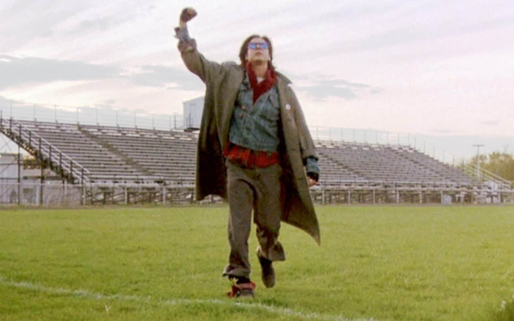
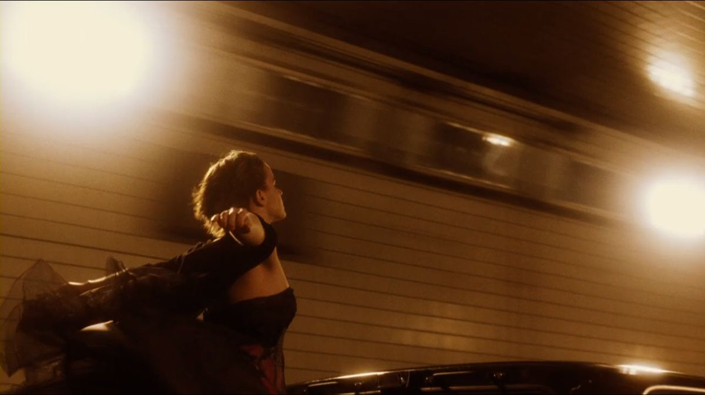
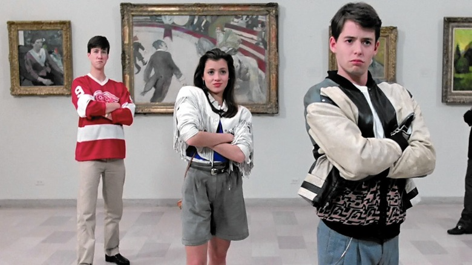

```{r setup, include=FALSE}

knitr::opts_chunk$set(echo = TRUE)
library(tidyverse)
library(spotifyr)
library(compmus)
library(plotly)

```

```{r, include = FALSE}
circshift <- function(v, n) {
  if (n == 0) v else c(tail(v, n), head(v, -n))
}

#      C     C#    D     Eb    E     F     F#    G     Ab    A     Bb    B
major_chord <-
  c(   1,    0,    0,    0,    1,    0,    0,    1,    0,    0,    0,    0)
minor_chord <-
  c(   1,    0,    0,    1,    0,    0,    0,    1,    0,    0,    0,    0)
seventh_chord <-
  c(   1,    0,    0,    0,    1,    0,    0,    1,    0,    0,    1,    0)

major_key <-
  c(6.35, 2.23, 3.48, 2.33, 4.38, 4.09, 2.52, 5.19, 2.39, 3.66, 2.29, 2.88)
minor_key <-
  c(6.33, 2.68, 3.52, 5.38, 2.60, 3.53, 2.54, 4.75, 3.98, 2.69, 3.34, 3.17)

chord_templates <-
  tribble(
    ~name, ~template,
    "Gb:7", circshift(seventh_chord, 6),
    "Gb:maj", circshift(major_chord, 6),
    "Bb:min", circshift(minor_chord, 10),
    "Db:maj", circshift(major_chord, 1),
    "F:min", circshift(minor_chord, 5),
    "Ab:7", circshift(seventh_chord, 8),
    "Ab:maj", circshift(major_chord, 8),
    "C:min", circshift(minor_chord, 0),
    "Eb:7", circshift(seventh_chord, 3),
    "Eb:maj", circshift(major_chord, 3),
    "G:min", circshift(minor_chord, 7),
    "Bb:7", circshift(seventh_chord, 10),
    "Bb:maj", circshift(major_chord, 10),
    "D:min", circshift(minor_chord, 2),
    "F:7", circshift(seventh_chord, 5),
    "F:maj", circshift(major_chord, 5),
    "A:min", circshift(minor_chord, 9),
    "C:7", circshift(seventh_chord, 0),
    "C:maj", circshift(major_chord, 0),
    "E:min", circshift(minor_chord, 4),
    "G:7", circshift(seventh_chord, 7),
    "G:maj", circshift(major_chord, 7),
    "B:min", circshift(minor_chord, 11),
    "D:7", circshift(seventh_chord, 2),
    "D:maj", circshift(major_chord, 2),
    "F#:min", circshift(minor_chord, 6),
    "A:7", circshift(seventh_chord, 9),
    "A:maj", circshift(major_chord, 9),
    "C#:min", circshift(minor_chord, 1),
    "E:7", circshift(seventh_chord, 4),
    "E:maj", circshift(major_chord, 4),
    "G#:min", circshift(minor_chord, 8),
    "B:7", circshift(seventh_chord, 11),
    "B:maj", circshift(major_chord, 11),
    "D#:min", circshift(minor_chord, 3)
  )

key_templates <-
  tribble(
    ~name, ~template,
    "Gb:maj", circshift(major_key, 6),
    "Bb:min", circshift(minor_key, 10),
    "Db:maj", circshift(major_key, 1),
    "F:min", circshift(minor_key, 5),
    "Ab:maj", circshift(major_key, 8),
    "C:min", circshift(minor_key, 0),
    "Eb:maj", circshift(major_key, 3),
    "G:min", circshift(minor_key, 7),
    "Bb:maj", circshift(major_key, 10),
    "D:min", circshift(minor_key, 2),
    "F:maj", circshift(major_key, 5),
    "A:min", circshift(minor_key, 9),
    "C:maj", circshift(major_key, 0),
    "E:min", circshift(minor_key, 4),
    "G:maj", circshift(major_key, 7),
    "B:min", circshift(minor_key, 11),
    "D:maj", circshift(major_key, 2),
    "F#:min", circshift(minor_key, 6),
    "A:maj", circshift(major_key, 9),
    "C#:min", circshift(minor_key, 1),
    "E:maj", circshift(major_key, 4),
    "G#:min", circshift(minor_key, 8),
    "B:maj", circshift(major_key, 11),
    "D#:min", circshift(minor_key, 3)
  )
```

# Histogram of Tempi from Playlist Songs and Soundtrack Songs

Column
-------
```{r, echo= FALSE}
soundtrack_tempi <-
  get_playlist_audio_features(
    "spotify",
    "37i9dQZF1DXb69UWhjrXsW?si=abdd084bcd204c7a&nd=1"
  ) |>
  slice(1:30) |>
  add_audio_analysis()
playlist_tempi <-
  get_playlist_audio_features(
    "spotify",
    "37i9dQZF1DX4OzrY981I1W"
  ) |>
  slice(1:30) |>
  add_audio_analysis()

moovie <-
  bind_rows(
    soundtrack_tempi |> mutate(playlist1 = "Playlist with songs from a Soundtrack"),
    playlist_tempi |> mutate(playlist1 = "Playlist with Songs that have 'Main Character Energy'"),
  ) |>
  mutate(playlist1 = factor(playlist1)) |>
  mutate(
    segments =
      map2(segments, key, compmus_c_transpose)
  ) |>
  mutate(
    segments =
      map(
        segments,
        mutate,
        pitches = map(pitches, compmus_normalise, "manhattan")
      )
  ) |>
  mutate(
    segments =
      map(
        segments,
        mutate,
        pitches = map2(pitches, lag(pitches), `-`)
      )
  ) |>
  mutate(
    segments =
      map(
        segments,
        mutate,
        timbre = map2(timbre, lag(timbre), `-`)
      )
  ) |>
  mutate(
    segments =
      map(
        segments,
        slice,
        -1
      )
  ) |>
  mutate(
    pitches =
      map(segments,
        compmus_summarise, pitches,
        method = "mean", na.rm = TRUE
      ),
    timbre =
      map(
        segments,
        compmus_summarise, timbre,
        method = "mean", na.rm = TRUE
      )
  ) |>
  mutate_at(vars(pitches, timbre), map, bind_rows) |>
  unnest(cols = c(pitches, timbre))


```

```{r, echo=FALSE}
table1 <- moovie |>                    # Start with awards.
  ggplot(                     # Set up the plot.
    aes(
      x = tempo)
  ) +
  geom_histogram(binwidth = 20) + 
  facet_wrap(~ playlist1) +
  theme_light()          # Use a simpler theme.
  
table1
```

Column
---
I wanted to look at the difference in tempos between the two playlists in my corpus to find out if there is any correlation between tempo and what deems a song good for a soundtrack or "main character" song. Both histograms seemed to be skewed right with a majority of their songs on one side and then more spread out as the tempo increases. I did notice that The songs that are a part of a soundtrack had a lower peak tempo count (centered about 100 bpm) whereas the playlist songs were generally a bit faster (centered about 120 bpm). What I really want to look at for tempo is if there is a change between the variance of tempo for each song within the two groups (somehow find the variance for each song and then make a histogram looking at that measurement rather than the spread of the tempo itself). This can tell me if there is a difference in how dynamic the two groupings are tempo-wise and see if that plays a role in why these songs elicit a feeling of being in a movie.

# Introduction

Column
-------
**What makes a song "Main Character Energy"?**

My corpus for Computational Musicology will dive into what makes a song feel like someone is the "main character". Beginning in the summer of 2020, peak of Covid, social media and Gen Z became obsessed with the feeling of making their life resemble a movie. We made highlight reels, posted "low-key" and aesthetic photo dumps, and began romanticizing even our daily coffee runs. I have grown up in awe of movies like "Perks of Being a Wallflower", "LadyBird", "Breakfast Club", and "Sixteen Candles". My parents drilled these movies into my head and deemed them "iconic". It's only right for our generation to want to become one of these characters ourselves. Songs like "Don't You (Forget About Me)" by Simple Minds, "Heros" by David Bowie, and even more recent songs like "Ribs" by Lorde have been universally recognized as songs that make you feel like you're in a movie. But what about these songs has this unique effect on people? Yes, some are actually a part of a movie's soundtrack, but others seem to create a movie all on their own. To build my dataset, I will grab [soundtracks from iconic coming of age and indie movies](https://open.spotify.com/playlist/37i9dQZF1DXb69UWhjrXsW) along with playlists that describe themselves as ["main character" or "in a coming of age movie"](https://open.spotify.com/playlist/37i9dQZF1DX4OzrY981I1W) or other titles with the same concepts. I hope to investigate the composition of these songs, lyrics, and types of instruments used to get to the bottom of what makes a song "main character energy". I would like to compare real movie soundtracks to songs that have been titled "to make you feel like you're in a movie" by social media or playlist creators. I hypothesize that the later group will show a stronger emphasis on unique and artistic lyrics, while the former will have a more complex musical score to propel the story along. I would also like to compare the playlist songs (not in a movie) to the top hits of today to find how the songs in the playlists have a different feeling than any of the other "favorite songs" of listeners. With the rise of this very specific genre, I think that Spotify will have a large majority of the songs needed for this corpus. I will use other people's playlists as well as one of my own where I can include all of my favorite songs that give me the "main-character" feeling. Songs that I look forward to analyzing, aside from the ones listed above, are "Wait Just A Little While" by the 502s, "Silver Lining" by Mt. Joy, "Tongue Tied" by Grouplove, and "Electric Love" by BORNS.

Column
------
```{r,echo=FALSE, out.width = '100%'}




```

# Playlist Songs vs Soundtrack Songs {data-navmenu="Visualizations"}

## Column

### Songs in a "Main Character" Playlist vs Songs from a Soundtrack

```{r, echo=FALSE}

movieHits <- get_playlist_audio_features("", "37i9dQZF1DXb69UWhjrXsW?si=abdd084bcd204c7a&nd=1")
mainCharacter <- get_playlist_audio_features("", "37i9dQZF1DX4OzrY981I1W")

movieVibes <-
  bind_rows(
    movieHits |> mutate(category = "Songs from a Soundtrack"),
    mainCharacter |> mutate(category = "Songs from 'Main Character' Playlist")
  )
options(repr.plot.width =9, repr.plot.height =9)


table <- movieVibes |>                    # Start with awards.
  ggplot(                     # Set up the plot.
    aes(
      x = valence,
      y = track.popularity,
      size = instrumentalness,
      colour = speechiness
    )
  ) +
  geom_point() + 
  facet_wrap(~ category) +
  theme_light() +             # Use a simpler theme.
  labs(                       # Make the titles nice.
    x = "Valence",
    y = "Popularity",
    colour = "Speechiness",
    size = "Instrumentalness"
  )+ 
  scale_colour_gradientn(colours=rainbow(4)) +
  geom_jitter(position = position_jitter(width = 0.3))
  
ggplotly(table)
```

## Column

I first wanted to look at the major differences between songs that people think are like a movie and songs that actually are in a movie. The most imediate thing I noticed when looking at the two scatterplots side-by-side was the differences in instrumentalness. I assumed that the soundtrack songs would show more instrumentalness and would focus on the timbre of the instruments to move the plot along. However, it was the opposite. The songs that playlist developers put into their "Main character energy" playlist had much higher levels of instrumentalness and a lower level of speechiness. A possible reason for this is that the lack of lyrics allows the lostener to fill in their own storyline or internal thoughts. The kind of instrumentalness serves as a backdrop to their own internal monologue. A movie does not need this and can have higher levels of speechiness during montages to fill in the silence. It can also be seen that the songs in the playlist are overall more popular than the soundtrack songs. This was expected, since there is a higher criteria from prefessionals in order to be a part of a soundtrack and many songs are made for a specific movie rather than for sheer artistic expression. Both groupings had similar valence and I intend on looking at the comparisons and differences between the two sounds (instruments used, timing, etc.) to get to the bottom of what makes these songs so perfect for a coming-of-age/indie/main character feeling.

# Chromagram of "Heros" vs Chromagram of "Green Light" {data-navmenu="Visualizations"}

Row {.tabset .tabset-fade}
---------

### Chromagram of "Heros" by David Bowie 

```{r, echo=FALSE}
wood <-
  get_tidy_audio_analysis("7Jh1bpe76CNTCgdgAdBw4Z?si=9562548f63ae43a9&nd=1") |>
  select(segments) |>
  unnest(segments) |>
  select(start, duration, pitches)

wood |>
  mutate(pitches = map(pitches, compmus_normalise, "euclidean")) |>
  compmus_gather_chroma() |> 
  ggplot(
    aes(
      x = start + duration / 2,
      width = duration,
      y = pitch_class,
      fill = value
    )
  ) +
  geom_tile() +
  labs(x = "Time (s)", y = NULL, fill = "Magnitude") +
  theme_minimal() +
  scale_fill_viridis_c()
```

### Chromagram of "Green Light" by Lorde

```{r, echo=FALSE}
wood1 <-
  get_tidy_audio_analysis("6ie2Bw3xLj2JcGowOlcMhb") |>
  select(segments) |>
  unnest(segments) |>
  select(start, duration, pitches)

wood1 |>
  mutate(pitches = map(pitches, compmus_normalise, "euclidean")) |>
  compmus_gather_chroma() |> 
  ggplot(
    aes(
      x = start + duration / 2,
      width = duration,
      y = pitch_class,
      fill = value
    )
  ) +
  geom_tile() +
  labs(x = "Time (s)", y = NULL, fill = "Magnitude") +
  theme_minimal() +
  scale_fill_viridis_c()
```

### Cross Chromagram Analysis of "Heros" and Green Light"

```{r, echo=FALSE}
compmus_long_distance(
  wood |> mutate(pitches = map(pitches, compmus_normalise, "chebyshev")),
  wood1 |> mutate(pitches = map(pitches, compmus_normalise, "chebyshev")),
  feature = pitches,
  method = "euclidean"
) |>
  ggplot(
    aes(
      x = xstart + xduration / 2,
      width = xduration,
      y = ystart + yduration / 2,
      height = yduration,
      fill = d
    )
  ) +
  geom_tile() +
  coord_equal() +
  labs(x = "Heros", y = "Green Light") +
  theme_minimal() +
  scale_fill_viridis_c(guide = NULL)
```

Row
------

I wanted to focus my chromograms on two songs that I believe create the largest sense of "Main Character Energy" for me, but for two very different reasons. I chose "Heros" by David Bowie because of its appearance in the coming of age movie, "Perks of Being a Wallflower". The scene where the main character, Charlie, lets go and screams out the sunroof while his new friends are driving through a tunnel is a scene that has stuck with me throughout years. The feeling of freedom and opportunity seemed to swell in that moment and the music wasn't just an addition to the scene, it seemed to be the leader of the scene. I got that same feeling when listening to "Green Light" by Lorde. The yells in the background are quite literally urging you to "go for it". For me, it feels like you are running towards something that you have been waiting for. Its opportunistic. I wanted to see how these two songs correlate on a chromographic level. In many ways, I see similar patterns between the two chromograms. Both start with strong energy from D (of which "Heros" continues with throughout the entire song). Both songs have very strong choruses that are shown with bursts of energy. Later in my corpus, I would like to look more into why the D chord may be so prominent in both of these songs and if that pattern is continued into other songs that give off the same "Main Character" vibe.

# Chroma-Based and Timbre Self-Similarity Matrix {data-navmenu="Visualizations"}

Row
------
**Chroma-Based (Top) and Timbre (Bottom) Self-Similarity Matrix of "Don't You (Forget About Me)" by Simple Minds**

```{r, echo = FALSE}
bzt <-
  get_tidy_audio_analysis("6yEAAIEHu4GcUFptg5W9kI") |> 
  compmus_align(bars, segments) |>                     
  select(bars) |>                                     
  unnest(bars) |>                                     
  mutate(
    pitches =
      map(segments,
        compmus_summarise, pitches,
        method = "rms", norm = "manhattan"              
      )
  ) |>
  mutate(
    timbre =
      map(segments,
        compmus_summarise, timbre,
        method = "rms", norm = "manhattan"              
      )
  )

bzt |>
  compmus_self_similarity(pitches, "cosine") |> 
  ggplot(
    aes(
      x = xstart + xduration / 2,
      width = xduration,
      y = ystart + yduration / 2,
      height = yduration,
      fill = d
    )
  ) +
  geom_tile() +
  coord_fixed() +
  scale_fill_viridis_c(guide = "none") +
  theme_classic() +
  labs(x = "", y = "")
```

```{r, echo = FALSE}
bzt |>
  compmus_self_similarity(timbre, "cosine") |> 
  ggplot(
    aes(
      x = xstart + xduration / 2,
      width = xduration,
      y = ystart + yduration / 2,
      height = yduration,
      fill = d
    )
  ) +
  geom_tile() +
  coord_fixed() +
  scale_fill_viridis_c(guide = "none") +
  theme_classic() +
  labs(x = "", y = "")
```


Row
---------------
The first area of the self-similarity matrix of this song that I want to focus on is from about 50 seconds to 110 seconds. When listening to the song and following along with the chroma-based self-similarity matrix, this section of time lines up to when "don't you forget about me" is sung multiple times. This explains the parallel dark blue lines that are shown in that "checker" box. After 100 seconds, however, we lose our anticipated "checkerboard pattern". There does not seem to be many sections within the song that repeat. This song does not follow the basic pop format of verse, chorus, verse, chorus, bridge, chorus. Rather, this song seems to have a beginning "intro" section and then its main section following (100 seconds and onward) 

The second area I want to point out is the brightest area within the timbre matrix (190 sec - 230 sec). Because it is the brightest part of the matrix, it is the "most different" from the rest of the song. I originally expected this section of the song to be the loudest when Jim Kerr goes into his "La - la la la la". This is also the point in "The Breakfast Club that John Bender (the "rebellious delinquent" of the movie) punches his fist in the air. However, the bright part was actually signaling the moment right *before* the burst of energy. This part is the quiet lead-in that builds anticipation to the big burst of music. I think this part showed to be the most different on the timbre matrix because much of the background music is cut off and you are left with long, drawn out chords. 

# Chordogram of "Electric Love" by BORNS {data-navmenu="Visualizations"}

Column
------
```{r, echo = FALSE}
electric_love <-
  get_tidy_audio_analysis("2GiJYvgVaD2HtM8GqD9EgQ?si=1f63eb60b2cb4424") |>
  compmus_align(sections, segments) |>
  select(sections) |>
  unnest(sections) |>
  mutate(
    pitches =
      map(segments,
        compmus_summarise, pitches,
        method = "mean", norm = "manhattan"
      )
  )

electric_love |> 
  compmus_match_pitch_template(
    key_templates,         # Change to chord_templates if descired
    method = "manhattan",  # Try different distance metrics
    norm = "manhattan"     # Try different norms
  ) |>
  ggplot(
    aes(x = start + duration / 2, width = duration, y = name, fill = d)
  ) +
  geom_tile() +
  scale_fill_viridis_c(guide = "none") +
  theme_minimal() +
  labs(x = "Time (s)", y = "")
```

Column
-------
I wanted to move on and look at other songs that give a similar "freedom" vibe as "Heros" and "Green Light" and see if there are any similarities between the chords used in these songs. In the Chromogram, we were able to see alot of D presence in both "Heros" and "Green Light", however I did not determine if that was the base of the chords or just a dominant one in a different chord progression. Listening to "Electric Love" there was a very apparent chord progression of A for 7 beats (as the tonic chord), to B minor for one beat (as the sub-dominant chord), and then to F# minor for 8 beats (as the dominant chord). Looking at the Chordogram of this song, the two lines around 50 seconds and 105 seconds were obviously the moments that stood out to me. In these moments, we are in the bridge of the song. This is the moment where the drums cut out and there is a sense of "calm before the storm", as we are waiting for the big burst of energy from the chorus. This is when the D chord is added into the mix very briefly. Its interesting that the three songs all have a "lead in" of sorts that are based around this D chord. 


# Spotify Timbre Coefficients between Playlist Songs and Soundtrack Songs {data-navmenu="Visualizations"}

Column
--------
```{r, echo = FALSE}
soundtrack <-
  get_playlist_audio_features(
    "thesoundsofspotify",
    "37i9dQZF1DXb69UWhjrXsW?si=abdd084bcd204c7a&nd=1"
  ) |>
  slice(1:30) |>
  add_audio_analysis()
playlist <-
  get_playlist_audio_features(
    "thesoundsofspotify",
    "37i9dQZF1DX4OzrY981I1W"
  ) |>
  slice(1:30) |>
  add_audio_analysis()
compare <-
  soundtrack |>
  mutate(genre = "Playlist with Songs from a Soundtrack") |>
  bind_rows(playlist |> mutate(genre = "Playlist with Songs that have 'Main Character Energy'"))
```

```{r, echo = FALSE}
compare |>
  mutate(
    timbre =
      map(
        segments,
        compmus_summarise,
        timbre,
        method = "mean"
      )
  ) |>
  select(genre, timbre) |>
  compmus_gather_timbre() |>
  ggplot(aes(x = basis, y = value, fill = genre)) +
  geom_violin() +
  scale_fill_viridis_d() +
  labs(x = "Spotify Timbre Coefficients", y = "", fill = "Genre")
```

Column
-------
To get a better idea of how I can compare the original two playlists in a more descriptive way other than numerically measured components, I looked to the Spotify Timbre Coefficients. One part I would like to point out about this violin graph is the stark similarity between the two playlists in coefficients 1, 6, and 8. In almost every coefficient, there was a general trend in the same direction between the two groupings, but these three coefficients seem to almost mirror each other. The other aspect that is of note is the higher variance of coefficient 2 in the playlist with songs that are meant to make you *feel* like your in a movie. The playlist with soundtrack songs seemed to be much less spread out. The second coefficient is focused on loudness. Does this wide variety of volume in the "Main Character" playlist correlate to the higher level of instrumentalness we saw in the side-by-side scatterplots?


# Conclusion

### Chart 1

```{r}
```
### Chart 2

```{r}
```
